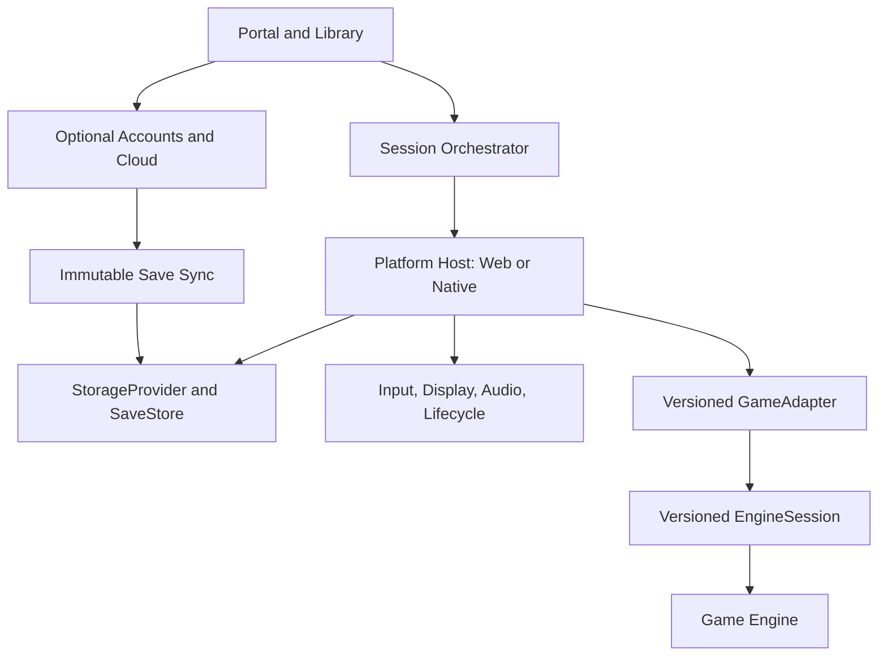

# Ultimatum Platform Architecture

**Status:** Canonical target architecture and incremental migration specification

**Repository baseline:** `0bb942f` (`main`), 2026-09-17

**Audience:** Maintainers and coding agents building the Ultimatum portal, shared runtime, native hosts, and game ports

**Purpose:** Define which capabilities already exist, which compatibility promises must be preserved, and which versioned platform boundaries should be extracted so future game ports do not reproduce platform plumbing.

This document is deliberately not a greenfield design. Ultimatum already has a substantial Ultima IV implementation on native iOS and the web. The platform must be extracted around that working system, with characterization tests and compatibility adapters, rather than replacing it with speculative abstractions.

Normative words such as **must**, **must not**, **should**, and **may** describe target platform requirements. Statements under **Implemented baseline** describe the repository at the baseline above, not promises that every target platform service has already been extracted.

---

## 1. Product definition

Ultimatum Project is a curated platform for playing lawfully obtained or explicitly authorized classic-game data through modern open-source or clean-room engines. It is not a ROM/download site and not merely a directory of unrelated browser ports.

The platform is intended to provide a consistent experience for:

- discovering supported games and editions;
- importing, acquiring where expressly authorized, and validating required game data;
- installing that data locally;
- launching WebAssembly or native engines;
- translating keyboard, mouse, controller, touch, and accessibility input into game semantics;
- persisting settings and saves safely;
- exporting, importing, versioning, recovering, and optionally synchronizing saves;
- managing supplemental content and mods where supported;
- updating engines without damaging player data; and
- crediting upstream projects and exposing applicable licenses and source obligations.

The public web release remains bring-your-own-data. An account must not be required to play an already installed game. Native acquisition flows may differ only where a separately reviewed authorization permits them.

The platform cannot generally prove ownership. Product and legal copy must not imply that a matching hash proves ownership or grants redistribution rights.

## 2. Current implementation baseline

### 2.1 Delivery surfaces

The repository currently contains three material product surfaces:

1. **Native iOS client.** A touch-first Objective-C++/UIKit host around the xu4-derived C/C++ engine under `vendor/ultima4-ios`. It supports portrait and landscape compositions, semantic touch controls, engine-owned menus, three adventure slots, transactional checkpoints and recovery, portable adventure transfer, journals, exploration maps, pins, dungeon views, combat targeting, settings, interruption handling, and development diagnostics.
2. **Web gameplay client.** `clients/web` builds the real engine with Emscripten, SDL2, zlib, and libxml2. The current baseline is a main-thread Asyncify runtime. A JavaScript `EngineClient` consumes a versioned JSON snapshot and submits semantic intents or compatibility key input through a C++ bridge.
3. **Public narrative and packaging site.** `clients/site` packages the homepage and game under `/play/`, provides corresponding source and notices, and chunks content-addressed engine assets for Cloudflare Workers Static Assets. Separate Cloudflare Workers deploy QA at `test.ultimatumproject.com` and production at `ultimatumproject.com`; both currently expose compile-gated Debug Tools for early-user testing while retaining separate cloud environments.

### 2.2 Implemented capabilities

| Capability | Implemented baseline |
|---|---|
| Engine integration | xu4-derived C/C++ engine runs natively on iOS and as Emscripten WebAssembly. |
| Semantic client protocol | Versioned web snapshot contract (`contractVersion: 1`), capabilities, live state, prompt generations, and semantic intent entrypoints. Native UIKit and web now share engine-facing map, dungeon, and combat-target semantics. |
| Web rendering | Private 320×200 SDL compatibility surface; the modern shell projects the 176×176 world region and renders responsive HTML UI separately. |
| Native rendering | SDL world presentation combined with UIKit-owned controls, panels, sheets, maps, and accessibility metadata. |
| Original-data import | Web folder, local ZIP, and CORS URL import with one complete-install selection, exact reviewed 103-file profiles, bounded archive extraction, staging, verification, and failed-replacement rollback. |
| Recognized editions | Reviewed English DOS/EGA profiles including the documented 1.01 data-fix variation. Other releases are rejected until independently reviewed. |
| Browser storage | IndexedDB library records for installed data; a separate IndexedDB three-slot save store; Emscripten IDBFS as a legacy working-copy mirror. |
| Native storage | Native filesystem data plus immutable checkpoint generations selected by atomically replaced `CURRENT` and `PREVIOUS` pointers. |
| Saves | Three isolated adventure slots; validated current/previous recovery; automatic safe checkpoints; stale-writer protection; emergency export; metadata-only journal transactions; local import/export. |
| Portable saves | Cross-platform `.u4save` version 1 packages shared by web and iOS, with allowlisted files, size checks, CRC32 integrity, and native semantic validation before activation. |
| Accounts and cloud library | Passwordless Supabase email accounts; web session persistence and iOS Keychain-backed sessions; optional sync of immutable `.u4save` generations; explicit conflict resolution; separate private game-data upload; account storage/history management; owner-scoped RLS and RPC publication. |
| Cloud quota | One server-enforced 100 MiB (104,857,600-byte) allowance per account across all retained adventure and game-data versions. Current implementation stores validated JSON/base64 packages in Postgres resource-version rows; private object storage remains a future scale migration. |
| Maps and game-state UI | Web and iOS expose adventure-owned exploration maps, a local minimap, discovered places, player pins, dungeon floor exploration, semantic dungeon actions, and combat target selection. |
| Settings and controls | Classic, Ultimatum, and Assisted experience profiles; graphics, message, exploration-map, and pin choices; touch interaction preferences; native D-pad size, handedness, and combat pacing. |
| Mobile interaction | Intent-based touch controls following the repository's PC-to-iOS playbook, including safe tap-to-walk, contextual interaction, combat targeting, dungeon controls, visible cancellation, and minimum touch geometry. |
| Packaging and licensing | Public BYOD package excludes original DOS data and alternate soundtrack packs, retains the soundtrack supplied with xu4, publishes corresponding engine source and licenses, and uses content-addressed engine chunks. |
| Browser lifecycle and offline shell | Page visibility, `pagehide`, freeze/resume, BFCache return, periodic safe checkpoints, IndexedDB/IDBFS flush, active-session reload recovery, installable PWA metadata, and a versioned service worker that never owns user data. |
| Runtime verification | Isolated real-engine browser suites, native model/layout tests, simulator flows, cross-client save round trips, signed device builds, and preservation of user saves through installation. |
| Phase 0.5 compatibility layer | Schema-backed Ultima IV port, save-provider, and session-provider descriptors are checked in under `ports/` and `packages/`. The active web client runs through compatibility `EngineSession`, import-adapter, IndexedDB library-provider, and `SaveStore` boundaries; native saves and SDL lifecycle transitions use the corresponding compatibility contracts. Logical storage roles map to existing physical records and mounts without migration. |

The detailed implementation status is recorded in:

- [`WEB_CLIENT_STATUS.md`](../engineering/WEB_CLIENT_STATUS.md)
- [`WEB_FEATURE_PARITY_PLAN.md`](../engineering/WEB_FEATURE_PARITY_PLAN.md)
- [`GAME_DATA_VERIFICATION.md`](../engineering/GAME_DATA_VERIFICATION.md)
- [`IOS_ADVENTURE_PACKAGE_RESULTS.md`](../engineering/IOS_ADVENTURE_PACKAGE_RESULTS.md)
- [`PUBLIC_SITE_RUNTIME_RESULTS.md`](../engineering/PUBLIC_SITE_RUNTIME_RESULTS.md)
- [`clients/site/CLOUDFLARE_SETUP.md`](../../clients/site/CLOUDFLARE_SETUP.md)
- [`vendor/ultima4-ios/ios/CONTROLS.md`](../../vendor/ultima4-ios/ios/CONTROLS.md)

### 2.3 Not yet implemented as shared platform services

The following are target capabilities, not current shared services:

- a multi-game catalog and personal library;
- a published `GameAdapter` SDK and conformance suite;
- a formal session-orchestrator state machine;
- OPFS storage and non-destructive IndexedDB-to-OPFS migration;
- a shared controller enumeration/remapping UI;
- a shared cross-engine audio manager;
- generic update channels and engine rollback;
- generic diagnostics/support bundles;
- a provider-neutral account/cloud interface extracted from the implemented Supabase-specific client and schema;
- a shared mod manager;
- a port-scaffolding CLI; and
- a reusable multi-game native application host.

### 2.4 Compatibility commitments

Extraction work must preserve these behaviors unless an explicit migration record changes them:

1. Existing browser installations and adventures remain readable.
2. Existing native slots and checkpoint generations remain readable.
3. `.u4save` version 1 remains importable and exportable on web and iOS.
4. Game-data import failures cannot replace a working installation.
5. Save publication failures cannot replace the last validated checkpoint.
6. Current/previous recovery and stale-writer detection remain available.
7. The engine remains authoritative for game legality, turn cost, action availability, and save validity.
8. Mobile UI continues to follow `docs/design/PC_to_iOS_Interface_Playbook.md`; generic platform UI must not regress touch-first behavior into desktop emulation.
9. Original game data stays out of public builds unless a game-specific legal record expressly authorizes distribution.
10. Test, staging, and production origins remain separate storage and identity domains.

## 3. Core architectural rules

### 3.1 Platform rule

> A game port supplies engine-specific detection, validation, filesystem mapping, semantic gameplay integration, and metadata. It must not invent a second portal, generic importer, storage transaction system, save browser, account protocol, updater, diagnostics format, or common settings shell.

### 3.2 Two versioned boundaries

Ultimatum has two different integration boundaries. They must not be collapsed into one oversized interface.

#### Boundary A: platform to port

The platform-to-port adapter covers:

- catalog and capability descriptors;
- import detection and install planning;
- engine/runtime requirements;
- logical mounts and launch preparation;
- save semantics and validation;
- settings and action descriptors;
- diagnostics mapping;
- migration hooks; and
- creation of a running engine session.

#### Boundary B: client shell to engine session

The shell-to-engine semantic protocol covers:

- versioned observable state snapshots;
- capabilities available in the current engine state;
- semantic intents rather than UI-specific gestures;
- prompt identities/generations;
- serialized action dispatch and outcomes;
- pause, flush, suspend, resume, and shutdown; and
- compatibility raw input where a port has not yet exposed a semantic intent.

Ultima IV already demonstrates why this separation matters. UIKit and responsive web layouts are different, while the engine's rules and player intents are shared.

## 4. Ownership boundary

| Ultimatum Platform owns | Each game port owns |
|---|---|
| Portal, catalog, library, and common management UI | Engine source, upstream tracking, and patches |
| Legal/acquisition presentation from reviewed records | Game/edition recognition evidence and required file roles |
| Browser/native file selection and import orchestration | Structural and semantic validation unique to the game |
| Staging, checksums, transactions, quotas, and installation publication | Mapping accepted files into engine-visible paths |
| Storage providers and namespace isolation | Declaring which data is source, generated, cache, save, or mod data |
| Save generations, retention, export, recovery, and future sync | Save file discovery, quiesce/flush rules, validation, summary, and migration |
| Shared settings and control-profile UI | Game-specific setting/action descriptors and engine translation |
| Device discovery and normalized input sources | Engine-authoritative semantic intent handling |
| Session state, launch progress, resource ownership, and crash containment | Engine initialization, readiness, pause, flush, and shutdown hooks |
| Generic rendering hosts, fullscreen, focus, screenshots, and overlays | Render surfaces, logical dimensions, projection, and engine integration |
| Common audio lifecycle and user policy | Mapping engine channels into supported mixer categories |
| PWA/app-shell caching and platform deployment | Versioned engine assets and port-specific cache declarations |
| Structured logging, redaction, and support bundle assembly | Structured engine events and game-specific error mapping |
| Accounts, devices, and cloud-save transport | Conflict-safe immutable save data through the save contract |
| Generic update/rollback policy | Compatibility ranges and save/install migrations |
| Accessibility shell and common navigation | Game-state semantics, labels, alternate intent paths, and exposed metadata |

An adapter may implement game-specific policy, but platform-owned persistence and UI must stay replaceable behind interfaces.

## 5. Design principles

1. **Preserve working contracts.** Extract around verified behavior before changing implementations.
2. **Bring lawful data.** Public releases distribute only what has an applicable authorization.
3. **Local first.** Installed data and saves remain on the device by default.
4. **Cloud is explicit.** Signing in never uploads original assets. Save sync and private game-data sync are separately enabled capabilities with distinct consent, policy, quota, retention, deletion, and legal treatment.
5. **Progressive enhancement.** Games work without accounts and, after installation, without a network when their declared capability permits it.
6. **Engine authority.** UI never reimplements game legality, turn costs, targeting validity, or save validity.
7. **Semantic interaction.** Touch, keyboard, mouse, and controller inputs express player intent; raw keys remain a compatibility mechanism.
8. **Capability declaration.** Hosts render declared support and current availability; they do not guess.
9. **Stable contracts, replaceable hosts.** Web, native, worker, storage, and cloud implementations sit behind versioned contracts.
10. **Failure containment.** A failed import, save, update, or engine cannot corrupt another install or the last known-good checkpoint.
11. **User-data priority.** Irreplaceable saves and imported data take precedence over caches, convenience, and migrations.
12. **Mobile is a composition, not a scaled desktop.** Portrait and landscape may render the same semantics differently.
13. **Preservation and attribution.** Upstream authors, licenses, corresponding source, modifications, and asset provenance are visible and release-gated.
14. **Evidence before abstraction.** A second real use case should pressure-test shared features. Do not build unused generality.

## 6. High-level architecture



The system has five architectural layers:

1. **Portal and library:** catalog, setup, game management, common preferences, and launch UX.
2. **Platform host:** browser or native implementations of storage, device APIs, lifecycle, rendering, and application policy.
3. **Port adapter:** installation, compatibility, mounts, save semantics, settings/actions, and session construction.
4. **Engine session:** the live, versioned semantic protocol between a shell and an engine instance.
5. **Optional cloud services:** identity, device metadata, immutable save transport/history, and explicitly enabled private game-data storage. The service exists outside this checkout; provider/auth integration remains to be bound to the clients.

## 7. Contract model

The following TypeScript is conceptual. Phase 0 must turn current behavior into schemas and tests before a package is published. Names may change through an architecture decision record, but responsibilities and compatibility constraints may not be silently lost.

### 7.1 Port descriptor

```ts
interface PortDescriptor {
  gameId: string;
  portId: string;
  adapterApiRange: string;
  portVersion: string;
  engine: {
    id: string;
    version: string;
    upstreamUrl: string;
    sourceUrl: string;
    licenseId: string;
  };
  editions: EditionDescriptor[];
  capabilities: GameCapabilities;
  actionsSchemaVersion: number;
  settingsSchemaVersion: number;
  saveSchemaVersion: number;
}
```

Catalog presentation metadata may reference this descriptor but should remain platform-controlled and localizable.

### 7.2 Platform-to-port adapter

```ts
interface GameAdapter {
  readonly descriptor: PortDescriptor;

  detect(
    inventory: ImportInventory,
    options: OperationOptions
  ): Promise<DetectionResult[]>;

  createInstallPlan(
    match: DetectionResult,
    options: OperationOptions
  ): Promise<InstallPlan>;

  validateInstall(
    context: InstallContext,
    options: OperationOptions
  ): Promise<ValidationReport>;

  getRuntimeRequirements(context: LaunchContext): RuntimeRequirements;
  getMountPlan(context: LaunchContext): Promise<MountPlan>;
  getRenderPlan(context: LaunchContext): RenderPlan;
  getActions(context: InstallContext): GameAction[];
  getSettingsSchema(context: InstallContext): SettingsSchema;
  getSaveDescriptor(context: InstallContext): SaveDescriptor;
  getModResolver?(context: InstallContext): ModResolver;

  createSession(
    context: LaunchContext,
    host: EngineHost,
    options: OperationOptions
  ): Promise<EngineSession>;

  migrateInstall?(
    from: number,
    to: number,
    context: MigrationContext,
    options: OperationOptions
  ): Promise<void>;

  migrateSave?(
    snapshot: SaveSnapshot,
    target: SaveTarget,
    options: OperationOptions
  ): Promise<SaveSnapshot>;
}

interface OperationOptions {
  signal: AbortSignal;
  reportProgress(event: ProgressEvent): void;
}
```

Detection results and install plans must use opaque inventory entry IDs. Adapters do not receive unrestricted browser handles or arbitrary native filesystem access.

### 7.3 Engine session

```ts
interface EngineSession {
  readonly contractVersion: string;
  readonly sessionId: string;

  start(): Promise<void>;
  getSnapshot(): Promise<EngineSnapshot>;
  subscribe(listener: (event: EngineEvent) => void): Unsubscribe;
  dispatch(intent: IntentEnvelope): Promise<IntentResult>;
  requestCheckpoint(reason: CheckpointReason): Promise<CheckpointResult>;
  pause(reason: PauseReason): Promise<void>;
  resume(reason: ResumeReason): Promise<void>;
  quiesce(reason: FlushReason): Promise<QuiesceResult>;
  shutdown(reason: ShutdownReason): Promise<void>;
}

interface IntentEnvelope {
  intentId: string;
  sequence: number;
  kind: string;
  parameters?: unknown;
  expectedPromptGeneration?: number;
  expectedStateRevision?: number;
}
```

Session commands must be serialized by the adapter. A browser callback must not directly re-enter an engine that is yielding through Asyncify or an equivalent mechanism. Stale prompt generations and duplicate intent IDs must be rejected without consuming a turn.

Snapshots are additive within a major contract version. Removing or changing field meaning requires a new major version and compatibility gate.

### 7.4 Capabilities

```ts
interface GameCapabilities {
  offline: boolean;
  saves: "none" | "opaque-files" | "managed";
  mods: "none" | "files" | "packages" | "custom";
  multiplayer: "none" | "local" | "peer" | "server";
  rendering: ("canvas2d" | "webgl" | "webgl2" | "webgpu" | "dom" | "native")[];
  threads: "none" | "optional" | "required";
  pointerLock: "none" | "optional" | "required";
  input: ("keyboard" | "mouse" | "gamepad" | "touch" | "gyro" | "text")[];
  cloudSaveEligible: boolean;
  supportsPause: boolean;
  supportsSuspend: boolean;
  supportsMultipleProfiles: boolean;
  supportsMultipleSurfaces: boolean;
}
```

Static capabilities describe the port. Dynamic snapshot state describes whether a particular action or feature is currently available.

## 8. Catalog, portal, and library

### 8.1 Implemented baseline

`clients/site` provides a public Ultimatum narrative page and one game route. `clients/web` has a single-game data dialog and adventure manager. There is not yet a general catalog or multi-game personal library.

### 8.2 Target catalog

Platform-controlled catalog records contain:

- stable `gameId`, `portId`, and URL slug;
- title, series, release year, publisher, and developer;
- collection and localizable descriptions;
- cover, hero, screenshots, and icon assets with provenance;
- engine, upstream, source, license, and Ultimatum modification records;
- supported editions, languages, expansions, and authorized demo/shareware data;
- port version and adapter compatibility range;
- browser/native requirements and declared capabilities;
- legal acquisition guidance and game-specific import instructions;
- known limitations and compatibility blocks;
- default control profiles; and
- release notes and notices.

### 8.3 Personal library

The local library distinguishes:

- catalog availability;
- locally installed data;
- locally playable state;
- cloud-known metadata; and
- data requiring repair or migration.

Signing in on a new device may show a library entry without providing copyrighted data required to launch it.

Library records may include install health, validation time, last played time, local playtime, most recent resumable checkpoint where safely detectable, favorites, selected engine channel, enabled mods, settings, control profile, storage usage, and sync state.

### 8.4 Shared game page and launcher

The common game page supports not-installed, importing, playable, update-available, repair-required, unsupported-host, and compatibility-disabled states. Actions appear only when relevant.

The launcher owns preflight, profile/checkpoint/mod selection, compatible engine selection, quota checks, permission prompts, progress, recoverable errors, safe mode, restart, exit, fullscreen, settings, and diagnostics. The engine remains responsible for deciding whether a game-specific checkpoint can be loaded.

## 9. Game-data import and installation

### 9.1 Existing Ultima IV behavior to preserve

The web importer already provides important platform-grade behavior:

- path normalization and traversal rejection;
- single-install selection without merging nested or sibling editions;
- exact reviewed profile matching;
- per-file, entry-count, compressed, and unpacked limits;
- duplicate-name and CRC rejection;
- filtering before reading unrelated folder files;
- staging outside the active install;
- revalidation during restore;
- atomic library publication with filesystem rollback; and
- separation of game data from adventure slots.

These become characterization requirements for the generic import framework.

### 9.2 Import sources

Subject to host capability and game-specific policy, the framework may accept:

- individual files;
- selected directories;
- explicitly supported archives;
- exported Ultimatum installation bundles;
- authorized downloadable data; and
- an authorized store integration whose API and terms permit it.

Drag/drop, picker, URL, and native document-provider sources feed the same inventory abstraction.

### 9.3 Detection pipeline


The platform inventories normalized path, size, timestamp when trustworthy, media type when useful, and hashes when requested. It computes a byte hash once per algorithm and shares the result. The adapter receives abstract entries, not ambient filesystem authority.

Detection candidates include game/edition IDs, confidence, evidence, required/optional/conflicting roles, language/expansion findings, destination mapping, warnings, and resolvable errors.

Exact hashes should remain the default where parsers depend on known binary layouts. Structural acceptance is allowed only when the adapter provides bounded semantic validation and fixtures for legitimate variation.

### 9.4 Atomic publication

An install plan reports detected edition, copied roles, estimated usage, missing optional features, conflicts, and privacy behavior before committing.

Publication follows:

1. write to a new staging generation;
2. verify size, hashes, and adapter validation;
3. durably record the install manifest;
4. atomically switch the active generation or transaction record;
5. retain or safely discard the predecessor according to policy; and
6. clean abandoned staging through bounded garbage collection.

A failed import cannot destroy or partially alter the active install.

### 9.5 Repair, migration, and uninstall

The platform supports revalidation, adding optional content, replacing missing assets, schema migration, clearing regenerable caches, uninstalling engine assets while preserving saves, and separately confirmed deletion of saves or cloud copies.

Uninstall operations must distinguish source data, generated data, caches, saves, profiles, mods, screenshots, and logs.

## 10. Storage architecture

### 10.1 Logical roles, not mandatory engine paths

The platform namespace is logical:

```text
games/{gameId}/installs/{installId}/
  manifest
  source-data
  generated-data
  engine-cache
  profiles
  mods
  screenshots
  logs

games/{gameId}/profiles/{profileId}/
  save-generations
  settings
```

These are roles and identifiers, not required POSIX paths. The adapter maps them to engine-visible mounts. This preserves current Ultima IV mappings such as `/ultima4`, `/home/web_user/.xu4`, IndexedDB records, and native application-support directories while allowing later migration.

### 10.2 Providers

```ts
interface StorageProvider {
  readonly id: string;
  readonly capabilities: StorageCapabilities;
  beginTransaction(scope: StorageScope): Promise<StorageTransaction>;
  read(ref: StorageRef): Promise<Uint8Array>;
  stat(ref: StorageRef): Promise<StorageStat | null>;
  list(scope: StorageScope): AsyncIterable<StorageEntry>;
  estimate(): Promise<StorageEstimate>;
}
```

Target implementations include:

- IndexedDB, required as the compatibility provider for existing browser data;
- OPFS, preferred for suitable new browser installs after migration behavior is proven;
- in-memory storage for tests and ephemeral demos; and
- native filesystem providers.

OPFS is not a prerequisite for extracting the SDK. No migration may delete IndexedDB data until the new copy has been verified and the user can recover or export it.

### 10.3 Durability rules

- Emscripten memory and MEMFS are never authoritative durable storage.
- Irreplaceable data uses staged writes and atomic publication or an equivalent transaction.
- Saves flush at declared checkpoints, orderly exit, safe lifecycle transitions, and bounded periodic intervals where the engine permits it.
- A background event is not assumed to grant enough time for asynchronous browser persistence; UI continues to advise explicit saving where necessary.
- Save migrations snapshot the last known-good generation first.
- One active writer per install/profile is enforced unless the port declares and proves otherwise.
- Regenerable caches are isolated from user-owned data.

## 11. Save architecture

### 11.1 Separation of responsibilities

The adapter supplies a `SaveDescriptor` and semantic hooks. The platform supplies the `SaveStore`, generation publication, retention, UI, export/import orchestration, and future synchronization.

```ts
interface SaveDescriptor {
  schemaVersion: number;
  roles: SaveFileRole[];
  capture(context: SaveCaptureContext): Promise<SaveCandidate>;
  validate(candidate: SaveCandidate): Promise<SaveValidation>;
  summarize(candidate: SaveCandidate): Promise<SaveSummary>;
  prepareLoad(snapshot: SaveSnapshot): Promise<LoadPlan>;
  migrate?(snapshot: SaveSnapshot, targetVersion: number): Promise<SaveCandidate>;
}

interface SaveStore {
  list(gameId: string, profileId: string): Promise<SaveRecord[]>;
  getGeneration(id: string): Promise<SaveSnapshot>;
  publish(candidate: ValidatedSaveCandidate, expectedCurrent?: string): Promise<SaveRecord>;
  restore(generationId: string, expectedCurrent: string): Promise<SaveRecord>;
  quarantine(candidate: SaveCandidate, reason: SaveProblem): Promise<QuarantinedSave>;
  remove(recordId: string, expectedCurrent?: string): Promise<void>;
}
```

### 11.2 Existing save contract

Ultima IV establishes these required platform semantics:

- current and previous validated generations;
- compare-and-swap publication to reject stale tabs or views;
- preservation of the last good generation after failure;
- quarantine/export of incomplete legacy fragments rather than unsafe loading;
- independent metadata transactions that do not replace the previous gameplay checkpoint;
- active-slot protection during import;
- explicit distinction between live progress and the last saved checkpoint; and
- semantic validation beyond transport checks before activation.

### 11.3 Portable `.u4save` compatibility

Version 1 packages use:

```json
{
  "format": "ultimatum-adventure",
  "version": 1,
  "game": "ultima4",
  "engine": "xu4",
  "label": "Adventure",
  "savedAt": 0,
  "files": [
    { "name": "party.sav", "size": 502, "crc32": "00000000", "data": "..." }
  ]
}
```

The existing codec has a bounded package size, a fixed allowlist, CRC32 transport-integrity checks, and game-specific native validation. CRC32 is not authentication.

Future generic snapshot manifests may add IDs, SHA-256 hashes, engine/edition versions, mod-set hashes, playtime, screenshots, migration versions, generation ancestry, and cloud tokens. They must do so through a new version or an external envelope while preserving version 1 import/export.

One possible target metadata record is:

```ts
interface SaveManifest {
  formatVersion: number;
  saveId: string;
  generationId: string;
  parentGenerationId?: string;
  gameId: string;
  installId: string;
  profileId: string;
  displayName: string;
  createdAt: string;
  modifiedAt: string;
  engineId: string;
  engineVersion: string;
  portVersion: string;
  gameEditionId: string;
  saveSchemaVersion: number;
  modSetHash?: string;
  contentHash: string;
  files: SaveFileEntry[];
  playtimeSeconds?: number;
  screenshotRef?: string;
}
```

### 11.4 Cloud sync

Cloud save sync is optional and operates on immutable validated generations, not live engine files. It must never merge opaque binary saves.

The protocol supports checksums, resumable transfer, optimistic concurrency, device IDs, conflict detection, keep-local/keep-cloud/keep-both resolution, history, restore, deletion retention, encryption, quotas, and redacted reporting.

Original assets are not uploaded merely because the user signs in. The
implemented Supabase client exposes game-data upload as a separate explicit
action from checkpoint sync. Both resource types currently share one 100 MiB
account allowance while retaining separate validation, deletion, and UI flows.
`account_resources` holds stable adventure/game-data identities and
`account_resource_versions` holds immutable package generations; authenticated
RPCs validate packages, serialize publication, enforce quota, and use
compare-and-swap against the reviewed current version. The browser uses only a
publishable key; ownership is enforced from `auth.uid()` with RLS and revoked
direct writes. This concrete provider must later be placed behind a versioned,
provider-neutral platform contract rather than copied into each port.

## 12. Session and engine lifecycle

The `SessionOrchestrator` owns:

```text
idle → preflighting → mounting → loading → running
                                      ↕
                                   paused
                                      ↓
                           quiescing → flushing → stopped

Any state → recoverable-error | fatal-error
```

Responsibilities include:

- resolving a compatible port, engine, edition, settings schema, and save generation;
- acquiring the single-writer lease;
- mounting logical storage roles;
- constructing display, audio, input, and lifecycle hosts;
- reporting structured progress;
- starting the engine session and waiting for readiness;
- serializing semantic intents;
- pausing or quiescing during platform lifecycle changes;
- requesting safe checkpoints without claiming they succeeded before durable publication;
- flushing before orderly shutdown;
- detecting unclean termination and crash loops;
- offering recovery, safe mode, repair, or rollback; and
- releasing workers, canvases, audio contexts, locks, timers, and other resources.

### Current Ultima IV constraint

The web engine currently uses main-thread Asyncify. Engine actions that may yield must be queued through the SDL-owned loop. A platform extraction must preserve this constraint behind `EngineSession.dispatch`; it must not expose direct `ccall` re-entry to portal UI.

Worker-hosted execution is a target option, not a prerequisite. A worker migration must pass the same semantic and lifecycle conformance tests.

## 13. Rendering and display

The platform supplies host services for surface allocation, viewport/safe-area information, fullscreen, focus, visibility, pointer ownership, screenshots, and shell overlays.

The adapter supplies a `RenderPlan`:

```ts
interface RenderPlan {
  surfaces: RenderSurfaceDescriptor[];
  logicalViewport?: { width: number; height: number };
  scaling: "integer" | "fit" | "fill" | "custom";
  aspectPolicy: "preserve" | "stretch" | "custom";
  highDpi: "native" | "logical" | "adapter";
  projection?: RenderProjection[];
}
```

The contract must support:

- a directly presented engine canvas;
- a private compatibility canvas projected into a shell-owned surface, as Ultima IV does today;
- DOM or native overlays;
- multiple engine surfaces;
- worker-owned transferable canvases;
- WebGL/WebGPU surfaces; and
- native views.

The platform must not assume the engine owns the final screen composition. Phone portrait and landscape are separate compositions that may share semantics without sharing geometry.

## 14. Audio lifecycle

The target shared audio host manages user-gesture requirements, master/music/effects/speech/UI categories, mute, focus/background policy, audio-context recovery, output changes where available, and diagnostics.

Adapters declare which categories they can map. A master-only adapter is valid. The platform must not claim category control when an engine exposes only one channel.

Existing SDL/audio behavior remains behind the first adapter until equivalent shared behavior has runtime evidence. Extraction must not regress mobile-browser startup or background recovery.

## 15. Input and semantic actions

### 15.1 Action descriptors

```ts
interface GameAction {
  id: string;
  label: string;
  category: string;
  kind: "button" | "axis1d" | "axis2d" | "pointer" | "text";
  contexts?: string[];
  repeat?: "none" | "key" | "continuous";
  required?: boolean;
  destructive?: boolean;
}
```

Descriptors enable common remapping UI. They do not transfer game legality into the platform. The current engine snapshot determines whether an action is available and may provide a contextual label or target.

### 15.2 Device layer

The target platform normalizes:

- physical keyboard codes and text/IME input;
- pointer buttons, wheel, absolute/relative motion, and pointer lock;
- Gamepad API/native controllers, hot-plugging, axes, dead zones, profiles, and rumble where supported;
- touch zones, virtual sticks, buttons, gestures, handedness, scale, and opacity;
- clipboard policy and paste where appropriate;
- optional gyro/orientation input; and
- accessibility switches and alternate activation.

### 15.3 Mobile requirements

Every critical action has a visible touch path that does not depend on hover, right-click, modifiers, or pixel-perfect targeting. Important gestures have visible alternatives. Controls preserve safe areas, minimum target sizes, cancellation, feedback, and world visibility.

The canonical design standard is [`PC_to_iOS_Interface_Playbook.md`](../design/PC_to_iOS_Interface_Playbook.md). Project-specific deviations require an explicit design record.

### 15.4 Profiles and conflicts

Bindings may exist at platform, game, device, and user scopes. Common UI identifies duplicates, missing required actions, inaccessible actions, and browser-reserved shortcuts. Every port ships a usable desktop profile; touch and controller profiles depend on declared capability and verification.

## 16. Settings

Settings have typed schemas, defaults, validation, scope, migration version, and a declared owner.

Scopes include account, device/host, platform, game, installation/edition, player profile, and session-only overrides.

Ultima IV's current experience profiles and device-level touch preferences are compatibility inputs. In particular, control size, handedness, and combat-presentation choices are device preferences and must not accidentally enter portable adventure packages or be reset by experience-profile restoration.

The platform renders schema-supported controls. A port registers a custom panel only when a common component cannot express the setting or when the setting requires live game-specific preview.

## 17. Mods and supplemental content

Mod support is opt-in per adapter. The target manager supports bounded import, manifest validation, compatibility, dependencies, conflicts, deterministic load order, mod profiles, enable/disable without modifying original data, save-manifest hashes, portable configuration without unauthorized payloads, and safe mode.

Official expansions, platform patches, graphics/audio packs, engine extensions, and community mods are distinct content types with different provenance and update policy.

Ultima IV's verified VGA overlay is supplemental content, not a generic mod. Alternate soundtrack packs were removed from distribution; any future return requires reviewed provenance and an explicit packaging decision.

## 18. Accounts and identity

Accounts are optional. They may provide identity, preferences, cloud-known library metadata, synchronized save generations, device registration/revocation, storage quotas, data export, and deletion.

Engine launch must not require network availability for a previously installed offline-capable game. Account failure must not lock local saves.

Game library membership does not prove ownership. Save and private game-data
resources have separate validation, consent, and deletion flows. In the current
implementation their retained versions consume a shared 100 MiB account quota;
future quota-policy changes require an explicit migration and updated user copy.

## 19. PWA, caching, hosting, and offline behavior

### 19.1 Implemented baseline

The current public build is static and content-addressed. Large Emscripten data is split into verified chunks for Cloudflare asset limits. The package includes corresponding source and notices. Browser game data and saves live outside the HTTP cache.

The web client now includes installable metadata and a versioned service worker. It caches the shell and content-addressed engine artifacts while leaving IndexedDB/IDBFS user data outside Cache Storage. Runtime lifecycle handling secures a checkpoint on visibility loss, `pagehide`, and freeze; restarts polling on BFCache/resume; requests persistent storage; and restores the latest authoritative slot when a browser-pruned tab reloads.

### 19.2 Remaining target behavior

The platform owns installable metadata, app-shell caching, engine-bundle caching, optional per-game packs, offline UX, safe invalidation, and rollback. Service-worker updates must never delete OPFS or IndexedDB user data.

Engine JS, WASM, data chunks, source, and manifest versions must be mutually compatible and content-addressed or atomically selected. Mixed cached engine versions must fail closed with a recoverable update action.

### 19.3 Environment isolation

Development, test, staging, and production origins have independent browser storage. Save movement between origins is explicit through portable packages until an authenticated sync protocol exists.

The existing public test deployment does not imply production release approval. Permission-pending assets in a test build are not automatically eligible for production.

## 20. Updates and compatibility

Version independently:

- platform shell;
- adapter API;
- semantic engine-session contract;
- port adapter;
- engine build;
- edition/profile definitions;
- install manifest;
- settings schema;
- save schema and portable package format;
- content packs; and
- cloud protocol.

The update manager verifies compatible ranges before launch, keeps a known-good engine where feasible, backs up saves before risky migration, distinguishes mandatory security/compatibility blocks from optional updates, isolates channels, and exposes release notes and attribution.

Compatibility metadata may block a known-corrupting engine/edition/mod combination. Such blocks must be signed or delivered through a trusted release channel when they can disable local launch.

An engine rollback must not silently reverse an already-migrated save. The adapter declares backward compatibility or supplies a safe migration/restore plan.

## 21. Diagnostics, privacy, and analytics

All components emit structured events containing component, severity, timestamp, session ID, versions, and a stable error code. User-facing copy is mapped separately so logs remain localizable and machine-readable.

The diagnostics surface may show host capabilities, permissions, storage backend/quota, install validation, adapter/engine versions, logical mounts, recent redacted logs, crash-loop state, display/audio/input detection, and save flush/sync status.

Support bundles exclude original data, save contents, local source paths, usernames, tokens, typed game text, screenshots, and input streams by default. Inclusion of any sensitive artifact requires an explicit preview and consent.

Product analytics are optional, minimal, disclosed, and separate from essential local diagnostics. Original filenames/hashes outside a reviewed allowlist, local paths, save content, journal/conversation text, screenshots, and gameplay input streams are not analytics.

## 22. Security model

Required controls include:

- strict CSP and narrow feature permissions;
- cross-origin isolation only for ports that require it;
- workers or process isolation where practical;
- reproducible/pinned build inputs and dependency provenance;
- versioned engine manifests and integrity checks;
- bounded archive extraction with path, duplicate, encryption, CRC, count, and size checks;
- normalized case/path handling;
- no execution of imported native binaries;
- parser resource limits and staging cleanup;
- platform and adapter validation before publication;
- least-privilege cloud authorization scoped to user/game/profile/save;
- CSRF/session protections and short-lived upload/download authorization;
- secret rotation, deletion, and incident-response procedures; and
- diagnostics redaction tests.

Imported data and mods are untrusted even when the original game is old. A known hash establishes compatibility with a reviewed byte set, not ownership, safety of every parser, or authenticity of an account.

## 23. Legal, licensing, and attribution

Every port has a reviewed record covering:

- engine license and source obligations;
- upstream source and modification disclosure;
- required original data and permitted acquisition guidance;
- distributable demo/shareware/freeware scope, if any;
- trademarks and presentation;
- third-party libraries and notices;
- provenance of screenshots, covers, icons, music, and copy;
- cloud-save or asset-storage implications;
- takedown/contact process; and
- release-artifact notice generation.

### Ultima IV acquisition distinction

The public web release is BYOD and links to lawful acquisition guidance. The native iOS bootstrap currently downloads a pinned archive from an Ultima Dragons mirror. Repository research found historical permission scoped to Ultima Dragons, not a blanket authorization for Ultimatum Project. That native path is therefore a game/platform-specific exception requiring legal review before it is treated as a reusable platform mode or a basis for broader public distribution.

See [`ULTIMA_IV_REDISTRIBUTION_NOTE.md`](../engineering/ULTIMA_IV_REDISTRIBUTION_NOTE.md). Free price, mirror availability, or a passing checksum does not itself grant redistribution rights.

## 24. Accessibility and localization

The portal targets WCAG 2.2 AA. Shared UI provides keyboard navigation, screen-reader semantics, logical focus, reduced motion, scalable text, high contrast, remappable controls, color-independent state, and accessible progress/errors.

The engine session exposes semantic labels, current selection/target, disabled reasons where safe, prompt type, and alternate intent paths. A controller maps to the same game semantics as touch and keyboard rather than a separate reduced feature set.

Catalog text, platform UI, manifests, dates, numbers, and storage sizes are localizable. Game-content languages are edition capabilities.

## 25. Port package and repository evolution

### 25.1 Current topology

The working Ultima IV port is intentionally not rearranged before interfaces are proven:

```text
clients/
  site/                 # homepage and public package
  web/                  # gameplay shell, web bridge, importer and stores
vendor/
  ultima4-ios/          # engine, shared mobile semantics, native iOS host
docs/
  design/
  engineering/
```

### 25.2 Target topology

After compatibility adapters and conformance tests exist, the repository may evolve toward:

```text
apps/
  web-portal/
  native-ios/
packages/
  adapter-sdk/
  semantic-session/
  runtime-web/
  storage/
  import-framework/
  save-manager/
  input-system/
  settings/
  diagnostics/
  catalog/
  ui/
ports/
  ultima-iv/
    port.manifest.json
    adapter/
    engine/
    patches/
    build/
    assets/
    controls/
    schemas/
    tests/
    THIRD_PARTY_NOTICES.md
    README.md
services/
  identity/
  save-sync/
tooling/
  cli/
  build/
  license-audit/
```

This is a migration destination, not authorization for a bulk move. Extract one boundary at a time, leave compatibility entrypoints, and keep both clients running after every step.

No port depends on another port or portal UI internals. Proven shared needs become platform APIs.

## 26. Developer tooling

The target toolchain provides manifest/schema validation, local launch, fixture-based import tests without proprietary bytes, fake storage/save/input/cloud providers, bundle size and memory reports, compatibility checks, notice generation, deterministic builds, upstream patch tracking, adapter conformance, and preview catalog entries.

Desired commands remain:

```text
ultimatum port create <game-id>
ultimatum port validate <game-id>
ultimatum port dev <game-id>
ultimatum port test <game-id>
ultimatum port build <game-id>
ultimatum port package <game-id>
```

The CLI is not a Phase 0 dependency. Initial extraction may use existing scripts while the contracts stabilize.

## 27. Testing and release gates

### 27.1 Characterization before extraction

Existing web and native suites are the first platform conformance fixtures. Before moving a boundary, capture tests for its current successful and failure behavior.

At minimum, preserve:

- exact and alternate-profile import;
- ambiguous directory and unsafe archive rejection;
- failed staging and durable-commit rollback;
- cancellation and retry;
- three-slot isolation;
- stale writer rejection;
- current/previous recovery;
- emergency export after persistence failure;
- metadata-only edits preserving the previous gameplay generation;
- `.u4save` web-to-iOS and iOS-to-web round trips;
- lifecycle checkpoint behavior;
- semantic prompt generation and duplicate rejection;
- return from panels/prompts to main controls;
- portrait, landscape, desktop, and mobile-web compositions; and
- release-package exclusion of original data, saves, test hooks, and debug features.

### 27.2 Platform contract tests

Every adapter eventually passes shared tests for import cancellation/retry, atomic installation, mount isolation, clean/forced shutdown, lifecycle flush, corrupt/conflicting save recovery, settings migration, input remapping, offline launch, update rollback, and diagnostics redaction.

### 27.3 Port-specific tests

Ports own edition fixtures expressed as metadata, import mapping, engine startup, semantic intents, save round trips, deterministic integration tests where possible, host/browser matrices, performance budgets, and game-specific regressions.

### 27.4 Runtime requirement

Build and unit success do not establish completion. Changed gameplay flows must run in the real engine and applicable UI, including cancellation and return to ordinary controls. Tests use isolated adventures and origins; they do not alter the user's saves.

For iOS changes, the repository's signed-device delivery workflow remains mandatory after relevant tests and a signed Release build succeed.

### 27.5 Stable release gate

A stable port release requires supported-edition import, two launch/exit cycles without save loss, update from the previous stable build where one exists, offline launch after installation when declared, no critical shell accessibility regression, licenses/notices present, a redacted support bundle, and a tested rollback/recovery path.

## 28. Migration plan

### Phase 0 — baseline and contract freeze

**Goal:** Make the existing system explicit before changing it.

- Inventory web, native, engine, import, save, settings, rendering, lifecycle, packaging, and legal boundaries.
- Publish schemas for the current snapshot contract and `.u4save` v1.
- Designate current source-of-truth documents and correct stale status matrices.
- Add characterization tests where behavior is currently documented but not contract-tested.
- Record the compatibility commitments in section 2.4 as release gates.
- Make no storage migration and no repository-wide move.

**Exit:** Current web and iOS releases build and pass their existing runtime suites using documented versioned contracts.

### Phase 0.5 — compatibility-layer extraction

**Goal:** Introduce reusable interfaces without changing user-visible behavior.

**Implementation complete:** The checked-in compatibility layer defines the port descriptor and
engine-snapshot schemas, validates the Ultima IV manifest, and places the active
web client behind compatibility `EngineSession`, import-adapter, IndexedDB
library-provider, and `SaveStore` boundaries. The browser provider projects its
unchanged slot records through record/generation operations; the native provider
projects immutable directories and atomic pointers through the same semantics.
The active iOS/SDL path now routes lifecycle and orderly-quit behavior through
a versioned native `EngineSession` compatibility state machine. A shared
provider manifest and executable conformance checks cover both active clients.
Native simulator/device verification remains a release gate rather than an
unimplemented compatibility boundary.

- Wrap the current web importer as the first import adapter and store provider.
- Wrap `EngineClient`/C++ bridge as the first `EngineSession`.
- Wrap browser `SaveStore` and native snapshot generations behind shared save semantics. The JavaScript type and asset now use this name; the old IndexedDB and `.u4save` identifiers remain compatibility-frozen.
- Define logical storage roles and map current physical locations without moving data.
- Extract catalog/port descriptors for Ultima IV.
- Add adapter and session conformance tests around current behavior.

**Exit:** Ultima IV runs through public internal interfaces on web and native, while old data and packages remain compatible.

### Phase 1 — local-first platform MVP

- Shared single-game catalog template and local library model.
- Generic import orchestration and install records.
- IndexedDB compatibility provider plus an experimental OPFS provider behind the same contract.
- Session orchestrator, common overlays, typed settings, control profiles, save management, and structured diagnostics.
- Generalize the existing PWA/service-worker update safety behind the platform host contract.
- Continue completing Ultima IV web parity rather than freezing game work during extraction.

**Exit:** Ultima IV and one architecturally different engine run without duplicating platform plumbing, while existing Ultima IV saves/imports remain compatible.

### Phase 2 — hardening through additional ports

- Pressure-test workers/threads, pointer lock, gamepad depth, non-tile rendering, install repair, engine rollback, and save compatibility.
- Add the port CLI and broader conformance suite after real duplication appears.
- Evaluate the second port through a legal, source/build, browser, input, storage, and performance spike before committing.

An RTS or first-person engine remains a useful pressure test because it challenges camera controls, pointer lock, multi-selection, worker needs, and save shape. A named candidate is not approved until its source, asset, build, and licensing feasibility are reviewed.

### Phase 3 — generalize and harden the implemented optional cloud capability

- Extract the checked-in Supabase identity/resource client behind a versioned provider-neutral contract.
- Preserve the implemented immutable save generations, history, conflicts, quota enforcement, deletion, and offline reconciliation.
- Move large validated packages from Postgres text rows to private object storage without changing resource IDs, lineage, checksums, or the 100 MiB user contract.
- Add selected synchronized settings.
- Preserve separate consent for private game-data upload; never upload original assets merely because the user signs in.

### Phase 4 — mods and richer library

- Supplemental-content and mod profiles.
- Favorites, playtime, screenshots, collections, and legitimately supported achievements.
- Community configuration sharing only after trust/moderation requirements exist.

### Phase 5 — reusable native hosts

- Extract the existing iOS host into a multi-game host without regressing the Ultima IV app.
- Reuse catalog records, semantic sessions, save manifests, settings schemas, and sync protocol.
- Add other native platforms by replacing host services, not by changing port semantics.

## 29. Required architecture decisions

Before the first non-Ultima integration, record short ADRs for:

1. Current-contract inventory and compatibility policy.
2. IndexedDB compatibility and OPFS migration/fallback.
3. Main-thread Asyncify baseline versus worker-hosted sessions.
4. `GameAdapter`, `EngineSession`, `StorageProvider`, and `SaveStore` version 1.
5. Prompt generations, intent sequencing, and event-loop serialization.
6. Logical mounts and Emscripten/native filesystem mapping.
7. `.u4save` v1 preservation and generic save-envelope evolution.
8. Private engine surfaces, projections, overlays, and multiple-surface rendering.
9. Portal route versus isolated runtime route.
10. Service-worker and engine-bundle version selection/rollback.
11. Browser support floor, including Safari, Firefox, Chromium, File System Access, OPFS, and threads.
12. Test/staging/production origin and data isolation.
13. Legal acquisition modes per game and host, including the current Ultima IV iOS exception.
14. The second engine used to pressure-test the abstractions.

## 30. MVP non-goals

The first multi-game proof does not require:

- hosting original commercial game assets;
- requiring cloud accounts or sync for the first multi-game proof;
- universal multiplayer;
- a public mod marketplace;
- social profiles, chat, or leaderboards;
- achievements for every game;
- automatic store-account extraction;
- a generic multi-game native shell completed before the web contracts stabilize;
- migrating all existing browser data to OPFS; or
- an abstraction that anticipates every future engine.

The existing native Ultima IV client is not a non-goal. Its continued operation and save compatibility are migration requirements.

## 31. Definition of a successfully integrated port

A port is integrated when:

1. Catalog, legal, license, source, and provenance records are complete.
2. Shared import orchestration detects supported editions and atomically installs lawful user data or authorized content.
3. The adapter launches only through the published platform contract.
4. The shell communicates with the engine through a versioned semantic session.
5. The platform host handles storage, lifecycle, display resources, device discovery, and session containment.
6. Saves survive restart, export/import successfully, retain a recoverable predecessor, and are protected during updates.
7. Settings and controls appear in common UI without moving game rules into the platform.
8. Offline behavior matches the declared capability.
9. Failures produce actionable, redacted diagnostics.
10. Upstream engine, modifications, corresponding source, and licenses are visible.
11. Runtime tests exercise real engine flows, cancellation, shutdown, and recovery.
12. No platform feature was copied into the port merely for expedience.

## 32. Source-of-truth policy

When documents disagree, use this precedence:

1. executable code and current tests at the stated repository baseline;
2. this document for target ownership, compatibility, and migration policy;
3. the current canonical status document for feature state;
4. dated runtime-result documents as historical evidence; and
5. earlier plans as intent, not proof of delivery.

Phase 0 must name and maintain one canonical feature-status matrix. Dated evidence files should not be rewritten to imply that later work existed at the time of the original run.

Known baseline documentation corrections include:

- web Journal and notebook support are implemented even though an older parity-matrix row says they are not exposed;
- native `.u4save` import/export and cross-client round trips are implemented even though older planning text calls them pending; and
- a public test hostname is deployed even though older public-release notes correctly state that production was not deployed during those earlier verification runs.

## 33. Guiding test

When implementing a feature, ask:

> If the next five engines needed this, would we want them all to implement it independently?

If no, put it behind a versioned platform interface. If only one engine needs it, keep it in that port until another real use case reveals the correct abstraction.

Also ask:

> Does this extraction preserve the existing web and iOS behavior, data, and recovery path?

If that answer is not proven by characterization and runtime tests, the extraction is not ready to ship.
